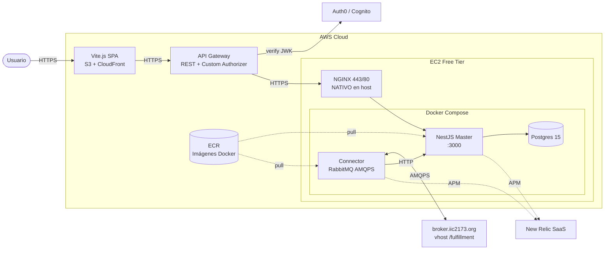

# CityExpress · Backend G15

> Red de mensajería **dimensional** · IIC2173 Arquitectura de Software · 2026-1
>
> Backend NestJS · Postgres · RabbitMQ · AWS EC2 + ECR + API Gateway · Frontend Vite.js (repo separado)

---

## Tabla de contenidos

- [CityExpress · Backend G15](#cityexpress--backend-g15)
  - [Tabla de contenidos](#tabla-de-contenidos)
  - [1. Visión general](#1-visión-general)
  - [2. Arquitectura](#2-arquitectura)
  - [3. Stack tecnológico](#3-stack-tecnológico)
  - [4. Estructura del repositorio](#4-estructura-del-repositorio)
  - [5. Metodología y flujo de trabajo (OBLIGATORIO)](#5-metodología-y-flujo-de-trabajo-obligatorio)
    - [5.1 BMAD / GSD](#51-bmad--gsd)
    - [5.2 AI usage logs](#52-ai-usage-logs)
    - [5.3 Gitflow](#53-gitflow)
    - [5.4 PR template](#54-pr-template)
    - [5.5 Quality gates](#55-quality-gates)
  - [6. Variables de entorno](#6-variables-de-entorno)
  - [7. Setup local (RDOC03)](#7-setup-local-rdoc03)
    - [Prerrequisitos](#prerrequisitos)
    - [Pasos](#pasos)
  - [8. Tests y cobertura](#8-tests-y-cobertura)
  - [9. Despliegue en AWS EC2 desde cero (RDOC02)](#9-despliegue-en-aws-ec2-desde-cero-rdoc02)
    - [9.1 Pre-requisitos AWS](#91-pre-requisitos-aws)
    - [9.2 Lanzar instancia EC2](#92-lanzar-instancia-ec2)
    - [9.3 Conectar y preparar el host](#93-conectar-y-preparar-el-host)
    - [9.4 Instalar Docker \& Docker Compose](#94-instalar-docker--docker-compose)
    - [9.5 Clonar repo y configurar `.env`](#95-clonar-repo-y-configurar-env)
    - [9.6 Configurar dominio (DNS)](#96-configurar-dominio-dns)
    - [9.7 NGINX directo en EC2 (RNF3 — NO en container)](#97-nginx-directo-en-ec2-rnf3--no-en-container)
    - [9.8 SSL con Let's Encrypt + Certbot](#98-ssl-con-lets-encrypt--certbot)
    - [9.9 Cronjob de renovación SSL automático (HTTPS-RNF3 = 5p)](#99-cronjob-de-renovación-ssl-automático-https-rnf3--5p)
    - [9.10 Re-despliegue tras cambios](#910-re-despliegue-tras-cambios)
    - [9.11 Troubleshooting frecuente](#911-troubleshooting-frecuente)
  - [10. Endpoints actuales](#10-endpoints-actuales)
  - [11. Roadmap E1](#11-roadmap-e1)
  - [12. Recursos](#12-recursos)
  - [13. Licencia](#13-licencia)

---

## 1. Visión general

**CityExpress** sucede a *QuackPackage* (E0). Cada grupo del curso opera una **ciudad** del catálogo (HGW, COR, REE, …) y debe:

- Recibir paquetes desde el broker central (`broker.iic2173.org`).
- Persistir todos los eventos para consulta posterior.
- Rutear paquetes hacia otras ciudades cuando el destino no es la propia.
- Auditar todas las acciones (`received`, `transit`, `transit-redirect`, `expired`, `delivered`) hacia la central.
- Entregar al cliente final cuando `deliverNotBefore` lo permita.

| Pieza | Repo |
|---|---|
| Backend (este repo) | `CityExpress-backendG15` |
| Frontend Vite.js | `CityExpress-frontendG15` |

**Estado actual:**

- E0 ✅ con **hotfix RF2** aplicado en este branch (`feature/e1-kickoff`).
- E1 ⏳ en desarrollo, milestones definidos en [`docs/milestones.md`](./docs/milestones.md).

---

## 2. Arquitectura



> Detalle de NFRs priorizados, estilos arquitectónicos y diagramas UML formales en [`docs/architecture.md`](./docs/architecture.md). El UML formal `.drawio` (RDOC01) se completa en M3.

---

## 3. Stack tecnológico

| Capa | Tecnología | Razón |
|---|---|---|
| Lenguaje | **TypeScript** strict (Node 20) | Tipos estrictos extremo a extremo |
| Framework | **NestJS 11** | Modular, DI-first, tooling maduro |
| ORM | **Prisma 7** + adapter `pg` | Migrations versionadas + tipos generados |
| DB | **PostgreSQL 15** | Relacional / transaccional |
| Mensajería | **RabbitMQ AMQPS** | Durable, ACK/NACK, replay, broker oficial del curso |
| Reverse proxy | **NGINX** **directo en EC2** (no en container) | RNF3 del enunciado |
| TLS | **Let's Encrypt** + Certbot | Renovación automática 2x/día |
| Cloud | **AWS** EC2 + ECR + S3 + CloudFront + API Gateway | Free Tier compatible |
| Auth | **Auth0**  / Cognito | RNF06 con JWK |
| Monitoreo | **New Relic** | RNF09 APM + infra |
| Tests | **Jest** + Supertest | Coverage ≥75% |
| Lint | ESLint 9 + Prettier | strict |
| Package manager | **pnpm** (corepack) | Eficiencia de disco |
| Containers | **Docker** + Docker Compose v2 | Compose obligatorio del enunciado |

---

## 4. Estructura del repositorio

```
CityExpress-backendG15/
├── src/
│   ├── main.ts                       # Bootstrap NestJS (puerto 3000)
│   ├── app.module.ts                 # Módulo raíz
│   ├── prisma.service.ts             # PrismaClient singleton (pg adapter)
│   ├── dto/
│   │   └── package.dto.ts            # CreatePackageDto, GetPackagesQuery
│   └── packages/
│       ├── packages.controller.ts    # POST/GET /packages, GET /packages/:id
│       ├── packages.service.ts       # Lógica de negocio + RF2 hotfix
│       └── packages.service.spec.ts  # Tests unitarios (≥75% cov)
├── prisma/
│   ├── schema.prisma                 # Modelo PackageEvent (M2: Route, AuditEvent)
│   └── migrations/                   # Migraciones versionadas
├── connector/
│   ├── index.js                      # Consumer RabbitMQ → POST /packages
│   ├── Dockerfile
│   └── package.json
├── test/
│   ├── app.e2e-spec.ts               # E2E baseline
│   └── jest-e2e.json
├── docs/                              # ← BMAD/GSD obligatorio
│   ├── roadmap.md
│   ├── milestones.md
│   ├── requirements.md
│   ├── architecture.md               # stub M1, formal en M3 (RDOC01)
│   ├── prompts/                      # AI usage logs (uno por sesión)
│   ├── listen-xxx.ts                 # Script de referencia AMQPS del staff
│   └── *.pdf                         # Enunciados E0/E1 + ayudantías
├── docker-compose.yml                # master + db + connector
├── Dockerfile                        # Multi-stage (builder + runner)
├── .example.env                      # Plantilla de variables (NUNCA commitear .env real)
├── package.json
├── tsconfig.json
└── README.md                         # ← este archivo
```

---

## 5. Metodología y flujo de trabajo (OBLIGATORIO)

> ⚠️ **Lectura obligatoria antes de abrir un PR.** El enunciado E1 es explícito: si usamos programación agéntica y no cumplimos con las reglas, la entrega es **anulada (1.0)** y puede considerarse plagio si no se declara.

### 5.1 BMAD / GSD

Todo el ciclo de desarrollo se rige por la metodología documentada en:

- [`docs/roadmap.md`](./docs/roadmap.md) — visión, milestones, riesgos.
- [`docs/milestones.md`](./docs/milestones.md) — ciclos, DoR, DoD, Gitflow, gates.
- [`docs/requirements.md`](./docs/requirements.md) — RFs/RNFs/RDOCs trazables.
- [`docs/architecture.md`](./docs/architecture.md) — NFRs priorizados, estilos, diagramas.

### 5.2 AI usage logs

Por cada sesión relevante con un agente IA (Claude, ChatGPT, Copilot Chat, Cursor, etc.):

- Se crea un archivo nuevo en `docs/prompts/YYYY-MM-DD-<tema>.md`.
- El archivo contiene: `Prompt` íntegro, `Output` resumido, `Decisión` final, `Tradeoffs` justificados.
- Cada PR enlaza el AI log que generó esos cambios.
- **Antes de la primera entrega: notificar al ayudante** que el equipo trabaja con agentes IA.

> Ejemplo: [`docs/prompts/2026-04-27-e1-kickoff.md`](./docs/prompts/2026-04-27-e1-kickoff.md).

### 5.3 Gitflow

```
main (protegida) ◀── develop ◀── feature/<scope>
                  ◀── hotfix/<scope>
```

- **`main`** está protegida en GitHub Settings:
  - Requiere PR (no push directo).
  - **Mínimo 2 reviewers** aprobando.
  - Status checks obligatorios: `build`, `lint`, `test:cov`.
  - Linear history.
- **`develop`** es la rama de integración.
- Las branches de trabajo se nombran `feature/<scope>` o `hotfix/<scope>`.
- Conventional Commits **en inglés** (`feat`, `fix`, `docs`, `refactor`, `test`, `chore`, `perf`).

### 5.4 PR template

Toda PR debe responder estas secciones (template detallado en [`docs/milestones.md §4.1`](./docs/milestones.md#41-pr-template-obligatorio)):

```markdown
## Resumen
## Cambios
## Cómo funciona
## Cómo se verificó
## AI usage
## Trazabilidad
```

### 5.5 Quality gates

| Gate | Criterio | Bloquea merge |
|---|---|---|
| `pnpm run build` | exit 0 | ✅ |
| `pnpm run lint` | 0 errors | ✅ |
| `pnpm run test:cov` | coverage del módulo ≥ **75%** | ✅ |
| `pnpm run test:e2e` | exit 0 (a partir de M2) | ✅ |
| Reviewers | 2 aprobados (en `main`) | ✅ |

---

## 6. Variables de entorno

Plantilla en [`.example.env`](./.example.env). **Jamás commitear `.env` ni `.pem`.**

| Variable | Descripción | Requerida | Ejemplo |
|---|---|---|---|
| `POSTGRES_USER` | Usuario Postgres | sí | `cityexpress` |
| `POSTGRES_PASSWORD` | Password Postgres | sí | `<random>` |
| `POSTGRES_DB` | Nombre DB | sí | `cityexpress` |
| `DATABASE_URL` | Connection string Prisma (apunta al servicio `db` de compose) | sí | `postgresql://${POSTGRES_USER}:${POSTGRES_PASSWORD}@db:5432/${POSTGRES_DB}?schema=public` |
| `RABBITMQ_URL` | AMQPS al broker oficial del curso | sí | `amqps://city.HGW:<pwd>@broker.iic2173.org:5671/fulfillment` |
| `RABBITMQ_QUEUE` | Cola de la ciudad | sí | `city.HGW.q` |
| `MASTER_API_URL` | URL interna que usa el connector | sí | `http://master:3000` |

> El descuento por `.env` commiteado es **−0.5 décimas** (E1). El `.pem` directamente invalida la corrección.

---

## 7. Setup local (RDOC03)

### Prerrequisitos

- Docker Engine ≥ 24
- Docker Compose v2 (plugin)
- (opcional para tooling fuera del container) Node 20 + pnpm

### Pasos

```bash
git clone git@github.com:vruizz22/CityExpress-backendG15.git
cd CityExpress-backendG15
cp .example.env .env
# editar .env con credenciales reales (DB + broker)

docker compose up -d --build

# verificar (10s después del up):
curl http://localhost:3000
curl 'http://localhost:3000/packages?page=1&limit=10'
```

Migraciones Prisma (en M2 cuando hagamos cambios al schema):

```bash
docker compose exec master pnpx prisma migrate dev
```

Logs en vivo:

```bash
docker compose logs -f master connector
```

Apagar todo:

```bash
docker compose down       # mantiene el volumen pgdata
docker compose down -v    # destruye también la DB
```

---

## 8. Tests y cobertura

```bash
# Unitarios
pnpm run test

# Unitarios con cobertura (gate 75%)
pnpm run test:cov

# E2E con Supertest
pnpm run test:e2e

# Watch mode mientras desarrollas
pnpm run test:watch
```

Estructura:

- Specs unitarios en `src/**/*.spec.ts` (mismo folder que el código).
- E2E en `test/*.e2e-spec.ts` con `jest-e2e.json`.
- Reporte HTML de coverage en `coverage/lcov-report/index.html`.

> El reporte de cobertura se sube como artefacto en CI (M2). Antes de M2, verificar localmente que cualquier módulo modificado supere 75%.

---

## 9. Despliegue en AWS EC2 desde cero (RDOC02)

> Esta guía está pensada para que **cualquiera del equipo pueda re-levantar el sistema desde cero** tras una caída total. Sigue los pasos en orden.

### 9.1 Pre-requisitos AWS

1. Cuenta AWS recién creada.
2. **Configurar Budget alerts** (RNF03) en `AWS Console → Billing → Budgets`:
   - Budget mensual de 5 USD con alertas al 50%, 80% y 100%.
3. Generar Key Pair (`AWS Console → EC2 → Key Pairs → Create key pair → tipo .pem`).
   - Guardar localmente y aplicar `chmod 400 cityexpress-g15.pem`.
4. **Nunca commitear el `.pem`.**

### 9.2 Lanzar instancia EC2

1. AWS Console → EC2 → Launch instance.
2. Name: `cityexpress-g15-prod`.
3. AMI: **Ubuntu Server 22.04 LTS** (Free Tier).
4. Instance type: **t3.micro** (Free Tier).
5. Key pair: el creado en 9.1.
6. Network → **Security Group nuevo** con reglas:
   - SSH (22) — Source: My IP.
   - HTTP (80) — Source: 0.0.0.0/0.
   - HTTPS (443) — Source: 0.0.0.0/0.
7. Storage: 8-20 GB gp3 (Free Tier).
8. Launch instance.
9. EC2 → Elastic IPs → **Allocate** → asociar a la instancia. Copia esta IP.

### 9.3 Conectar y preparar el host

```bash
chmod 400 cityexpress-g15.pem
ssh -i cityexpress-g15.pem ubuntu@<elastic-ip>

# dentro del servidor:
sudo apt update && sudo apt upgrade -y
sudo apt install -y ca-certificates curl gnupg lsb-release git ufw
```

### 9.4 Instalar Docker & Docker Compose

Instalación oficial (<https://docs.docker.com/engine/install/ubuntu/>):

```bash
# 1) GPG + repo
sudo install -m 0755 -d /etc/apt/keyrings
curl -fsSL https://download.docker.com/linux/ubuntu/gpg | \
  sudo gpg --dearmor -o /etc/apt/keyrings/docker.gpg
sudo chmod a+r /etc/apt/keyrings/docker.gpg

echo "deb [arch=$(dpkg --print-architecture) signed-by=/etc/apt/keyrings/docker.gpg] \
  https://download.docker.com/linux/ubuntu $(lsb_release -cs) stable" | \
  sudo tee /etc/apt/sources.list.d/docker.list > /dev/null

# 2) instalar
sudo apt update
sudo apt install -y docker-ce docker-ce-cli containerd.io docker-buildx-plugin docker-compose-plugin

# 3) habilitar uso sin sudo
sudo usermod -aG docker ubuntu
newgrp docker

# 4) verificar
docker version
docker compose version
docker run --rm hello-world
```

### 9.5 Clonar repo y configurar `.env`

```bash
# claves SSH para git (si el repo es privado)
ssh-keygen -t ed25519 -C "cityexpress-g15-ec2"
cat ~/.ssh/id_ed25519.pub
# pega la public key en GitHub → Settings → Deploy keys → del repo

git clone git@github.com:vruizz22/CityExpress-backendG15.git
cd CityExpress-backendG15

cp .example.env .env
nano .env  # rellenar con credenciales reales

docker compose up -d --build
docker compose ps      # los 3 servicios deben estar 'running'
docker compose logs --tail=80 master connector

curl http://localhost:3000
```

### 9.6 Configurar dominio (DNS)

1. Comprar dominio (Namecheap con GitHub Student Pack ofrece `.me` gratis por 1 año).
2. En el panel del registrador:
   - **A record** `@` → tu Elastic IP.
   - **CNAME** `www` → `<tu-dominio>` (o repetir A).
3. Esperar propagación (5-30 min). Verifica:

   ```bash
   dig +short <tu-dominio>
   dig +short www.<tu-dominio>
   ```

   ambos deben devolver tu Elastic IP.

### 9.7 NGINX directo en EC2 (RNF3 — NO en container)

```bash
sudo apt install -y nginx
sudo systemctl enable --now nginx

sudo tee /etc/nginx/sites-available/cityexpress.conf > /dev/null <<'NGINX'
server {
    listen 80;
    server_name <tu-dominio> www.<tu-dominio>;

    location / {
        proxy_pass http://127.0.0.1:3000;
        proxy_http_version 1.1;
        proxy_set_header Host $host;
        proxy_set_header X-Real-IP $remote_addr;
        proxy_set_header X-Forwarded-For $proxy_add_x_forwarded_for;
        proxy_set_header X-Forwarded-Proto $scheme;
        proxy_set_header Upgrade $http_upgrade;
        proxy_set_header Connection "upgrade";
        proxy_read_timeout 60s;
    }
}
NGINX

sudo ln -sf /etc/nginx/sites-available/cityexpress.conf /etc/nginx/sites-enabled/cityexpress.conf
sudo rm -f /etc/nginx/sites-enabled/default
sudo nginx -t
sudo systemctl reload nginx

curl -I http://<tu-dominio>     # debe devolver 200/302 desde NestJS
```

### 9.8 SSL con Let's Encrypt + Certbot

```bash
sudo apt install -y certbot python3-certbot-nginx
sudo certbot --nginx -d <tu-dominio> -d www.<tu-dominio>
# certbot edita el server block de NGINX y crea redirect 80 → 443.

curl -I https://<tu-dominio>    # debe devolver 200 con TLS
```

### 9.9 Cronjob de renovación SSL automático (HTTPS-RNF3 = 5p)

El paquete `certbot` instala un timer systemd que ejecuta el renovador 2 veces al día. Verifica:

```bash
systemctl list-timers | grep certbot
sudo certbot renew --dry-run
```

Si por alguna razón el timer no está activo, fija un crontab manual:

```bash
sudo crontab -e
# añadir:
0 0,12 * * * /usr/bin/certbot renew --quiet --post-hook "systemctl reload nginx"
```

### 9.10 Re-despliegue tras cambios

Cuando hay cambios en `main`:

```bash
ssh -i cityexpress-g15.pem ubuntu@<elastic-ip>
cd CityExpress-backendG15
git pull origin main
docker compose up -d --build
docker compose logs --tail=120 master
```

Para rollback:

```bash
git fetch --tags
git checkout <tag-anterior>
docker compose up -d --build
```

> **Importante:** la instancia debe sobrevivir reboots. Verifica que `nginx`, `docker`, y los servicios de compose tengan `restart: unless-stopped` (Compose) y `enable` (systemd para nginx/docker).

### 9.11 Troubleshooting frecuente

| Síntoma | Causa | Fix |
|---|---|---|
| `502 Bad Gateway` | Master no levantó | `docker compose logs master`; verifica `.env` y `DATABASE_URL` |
| Certbot falla con `DNS problem` | DNS aún no propagado | esperar y `dig +short`; reintentar `certbot --nginx` |
| Conexión AMQPS falla | Credenciales incorrectas o vhost mal escrito | revisar `RABBITMQ_URL` (usuario `city.<code>`, vhost `/fulfillment`) |
| `403 ACCESS-REFUSED` desde broker | Password incorrecto | pedir credenciales al ayudante |
| Container reinicia en loop | Migraciones Prisma fallan | `docker compose exec master pnpx prisma migrate status` |

---

## 10. Endpoints actuales

| Método | Path | Descripción | RF |
|---|---|---|---|
| GET | `/` | Healthcheck (mensaje de bienvenida) | – |
| GET | `/packages` | Lista paginada con filtros | RF1 / RF3 / RF4 (E0) |
| GET | `/packages/:id` | Detalle por **`packageId`** ← hotfix RF2 | RF2 (E0, corregido) |
| POST | `/packages` | Ingesta desde el connector | RNF1 / RNF2 (E0) |

**Próximos endpoints (M2-M4):** `/auth/*`, `/routes`, `/audit/*`, `/health`.

---

## 11. Roadmap E1

| Milestone | Ventana | Foco |
|---|---|---|
| **M1** | 27/04 → 30/04 | Kickoff: hotfix RF2 + docs BMAD + README *(este PR)* |
| **M2** | 30/04 → 04/05 | Auth0/Cognito + API Gateway + connector E1 |
| **M3** | 04/05 → 09/05 | Tabla distancias + ruteo + auditoría + UML formal |
| **M4** | 09/05 → 13/05 | Frontend Vite + S3/CloudFront + ECR + New Relic |
| **M5** | post-2026-05-03 | Demo + coevaluación |

Detalle: [`docs/roadmap.md`](./docs/roadmap.md).

---

## 12. Recursos

- Enunciado E0 → [`docs/IIC2173-E0-2026-1.pdf`](./docs/IIC2173-E0-2026-1.pdf)
- Enunciado E1 → [`docs/2026-1 _ IIC2173 - E1 _ CityExpress.pdf`](./docs/2026-1%20_%20IIC2173%20-%20E1%20_%20CityExpress.pdf)
- Script de referencia AMQPS del staff → [`docs/listen-xxx.ts`](./docs/listen-xxx.ts)
- Ayudantías → `~/.claude/data/ArquiSoftware/AY*.md`
- Broker oficial: `broker.iic2173.org:5671` (AMQPS, vhost `/fulfillment`, exchange `fulfillment.x`)

---

## 13. Licencia

MIT License © 2026-1 Grupo 15, IIC2173 Arquitectura de Software, Universidad de Chile.

```
