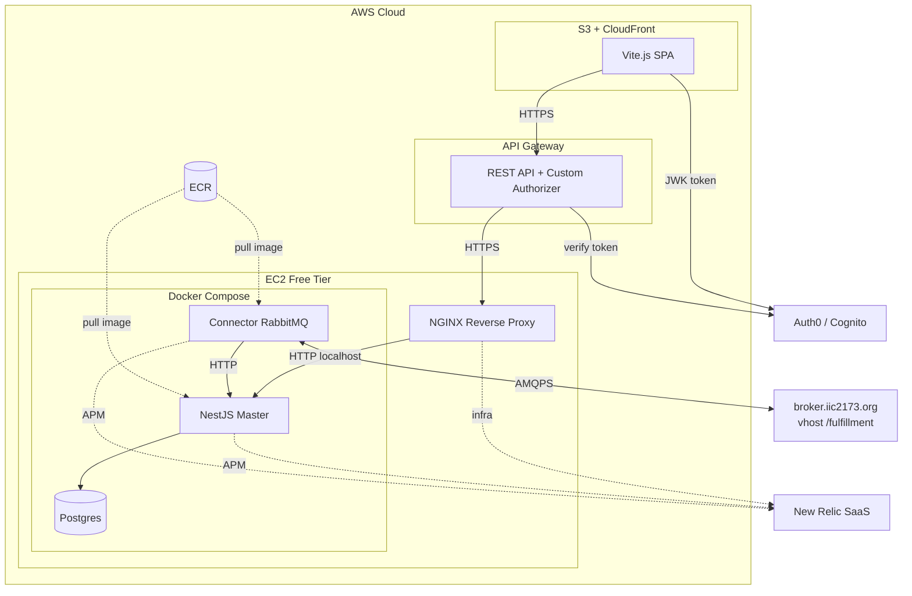
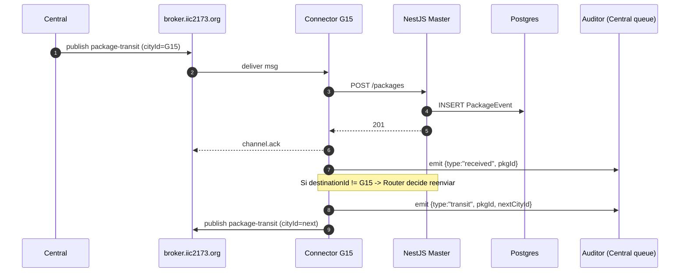

# CityExpress — Architecture (stub)

> ⚠️ **STUB para M1** — el diagrama UML formal (RDOC01, 3 ptos) se completa en M3 una vez que el sistema de ruteo y la auth estén diseñados.
>
> Este archivo establece la dirección arquitectónica acordada y las restricciones que toda decisión técnica de E1 debe respetar.

---

## 1. NFRs priorizados (E1)

Siguiendo el método de AY3/AY6/AY10/AY12 — al menos 3 NFRs ordenados con justificación:

| Prioridad | NFR | Justificación | Tácticas E1 |
|---|---|---|---|
| 1 | **Disponibilidad** | El emisor central envía paquetes constantemente; perder mensajes = penalización en RFs y rúbrica | Containers auto-restart (RNF10), retry Fibonacci, persistencia de eventos en Postgres antes de ACK |
| 2 | **Integrabilidad** | Sistema vive de hablar con broker, central, otras ciudades, frontend, Auth0, API Gateway, New Relic | API Gateway como SPoC (RNF04), CORS estricto, contratos JSON estables, Adapter por sistema externo |
| 3 | **Seguridad** | Auth obligatoria (RNF06), HTTPS extremo a extremo (RNF05), datos en tránsito | Auth0/Cognito + JWK + Custom Authorizer; Let's Encrypt; secrets en env vars (nunca repo) |
| 4 | **Performance** | Miles de paquetes durante corrección; consulta paginada obligatoria (RF3 E0) | Paginación default 25, índice `packageId` (M2), workers asíncronos para ruteo, retry no-bloqueante |
| 5 | **Resiliencia** | Broker puede caer; central puede dejar de responder | Retry Fibonacci hacia broker, replay desde DB, ACK/NACK explícitos |

---

## 2. Estilos arquitectónicos elegidos

| Estilo | Dónde se aplica | Por qué |
|---|---|---|
| **En Capas** | NestJS Master (Controller → Service → Prisma) | Separación de concerns; testeable con mocks por capa |
| **Cliente-Servidor** | Frontend Vite → API Gateway → Master | Front desacoplado del back; subdominio propio |
| **Event-Driven (EDA)** | Connector ↔ broker.iic2173.org ↔ otras ciudades | Asincronía, persistencia, replay (per AY12) |
| **Adapter** | Connector adapta payload broker (`body`) → DTO interno (`packageBody`) | Aísla cambios del schema externo |
| **API Gateway** | AWS API Gateway delante del Master | Auth centralizada, CORS, throttling, métricas (per AY5) |

> **No usamos Pub/Sub simple** (per AY12): broker durable + ACK/NACK + replay desde DB cuando hay caída.

---

## 3. Vista de componentes inicial (stub Mermaid)

---

## 4. Datos persistentes

### 4.1 Modelo actual (E0)

`PackageEvent` (Postgres, único modelo):

- `idpk` PK UUID — llave de idempotencia.
- `packageId` String — id del paquete (no único; M2 agrega índice).
- Resto de campos aplanados desde `packageBody`.

### 4.2 Propuesto E1 (M2)

- `Route` — tabla de distancias por ciudad destino, con `enabled`, `distance`, `transportCost`. Actualizable por mensaje `distance-table`.
- `AuditEvent` — log de auditoría enviado a central (transit/transit-redirect/expired/received/delivered) con timestamp, msgId.
- Índice no-único en `PackageEvent.packageId` (acelera el endpoint corregido del RF2 hotfix).
- (Opcional) `User` si Auth0 expone perfiles que queremos sincronizar.

---

## 5. Restricciones absolutas (heredadas del enunciado)

- **NestJS strict TypeScript** (`noImplicitAny`, `strictNullChecks`, `exactOptionalPropertyTypes` cuando se pueda activar).
- **Nunca `any`** sin justificación documentada.
- **DTOs validados** (Zod o class-validator) — pendiente desde E0.
- **Result<T,E>** o excepciones tipadas — sin silent swallows.
- **AWS Free Tier** únicamente (no Heroku/Lightsail/Elastic Beanstalk/Amplify/Cognito-en-E0/Netlify/Firebase salvo notificaciones móviles).
- **NGINX en EC2 nativo, no en container** (RNF3 E0 vigente).
- **No commitear `.env` ni `.pem`** (sanción explícita en E1).

---

## 6. TODO M3 (cuando este stub se convierte en RDOC01 formal)

- [ ] Diagrama Draw.io con stereotypes `<<component>>`, `<<subsystem>>`, `<<service>>` (siguiendo AY3).
- [ ] Interfaces named (lollipop / socket) con prefijo `I`.
- [ ] Anotaciones UML Notes con cada NFR mapeado al componente que lo soporta.
- [ ] Estilo arquitectónico anotado en cada subsistema relevante.
- [ ] Componentes desagregados al nivel: Master (Controllers, Services, Repositories, Guards), Connector (BrokerClient, RouterWorker, AuditClient), Frontend (Views, Stores, AuthGateway).
- [ ] Versionar el `.drawio` y exportar PNG/SVG anclado en este archivo.

---

## 7. Diagrama de secuencia objetivo (M3 — sketch)

---

## 8. Referencias

- Ayudantías AY3 (UML), AY5 (API Gateway), AY6 (NFRs), AY8 (Workers), AY10/AY12 (Diagramación avanzada + Event Bus).
- Enunciado E1 — `docs/2026-1 _ IIC2173 - E1 _ CityExpress.pdf`.
