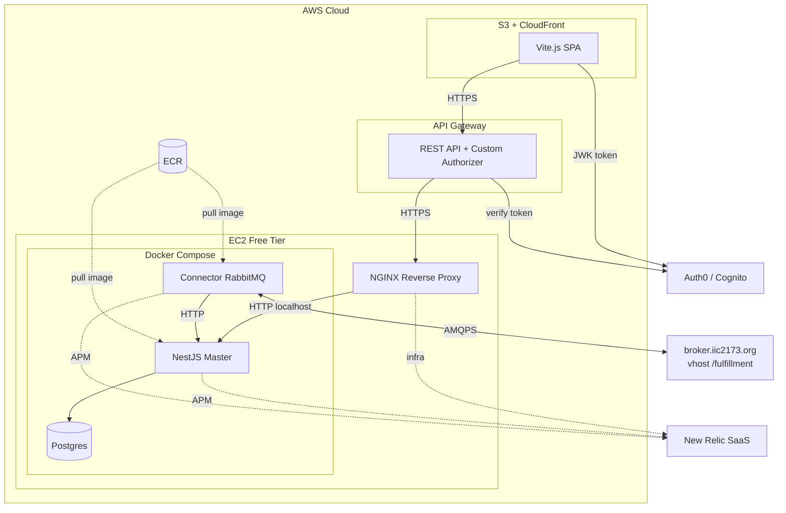
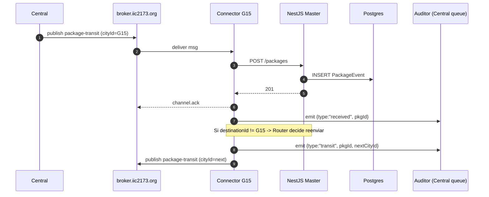
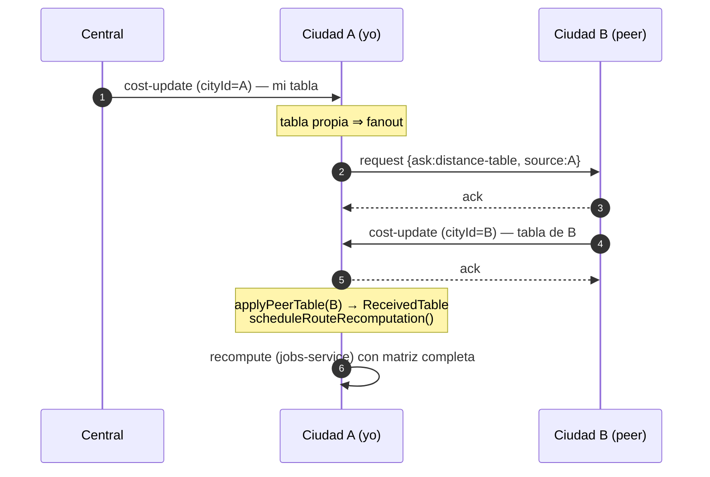
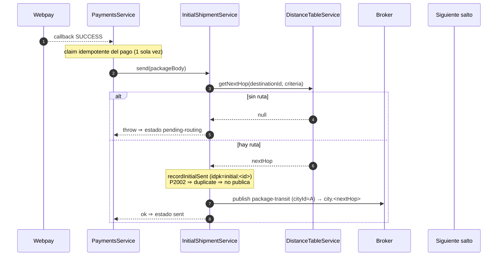
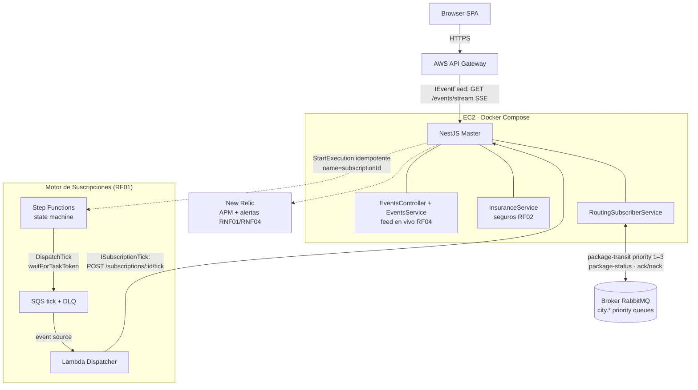
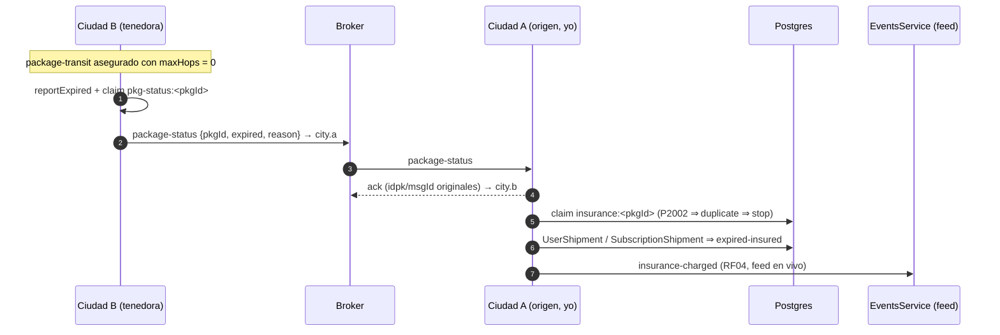

# CityExpress — Architecture (stub)

> ⚠️ **STUB para M1** — el diagrama UML formal (RDOC01, 3 ptos) se completa en M3 una vez que el sistema de ruteo y la auth estén diseñados.
>
> Este archivo establece la dirección arquitectónica acordada y las restricciones que toda decisión técnica de E1 debe respetar.

---

## 1. NFRs priorizados (E1)

Siguiendo el método de AY3/AY6/AY10/AY12 — al menos 3 NFRs ordenados con justificación:

| Prioridad | NFR | Justificación | Tácticas E1 |
|---|---|---|---|
| 1 | **Disponibilidad** | El emisor central envía paquetes constantemente; perder mensajes = penalización en RFs y rúbrica | Containers auto-restart (RNF10), retry Fibonacci, persistencia de eventos en Postgres antes de ACK |
| 2 | **Integrabilidad** | Sistema vive de hablar con broker, central, otras ciudades, frontend, Auth0, API Gateway, New Relic | API Gateway como SPoC (RNF04), CORS estricto, contratos JSON estables, Adapter por sistema externo |
| 3 | **Seguridad** | Auth obligatoria (RNF06), HTTPS extremo a extremo (RNF05), datos en tránsito | Auth0/Cognito + JWK + Custom Authorizer; Let's Encrypt; secrets en env vars (nunca repo) |
| 4 | **Performance** | Miles de paquetes durante corrección; consulta paginada obligatoria (RF3 E0) | Paginación default 25, índice `packageId` (M2), workers asíncronos para ruteo, retry no-bloqueante |
| 5 | **Resiliencia** | Broker puede caer; central puede dejar de responder | Retry Fibonacci hacia broker, replay desde DB, ACK/NACK explícitos |

---

## 2. Estilos arquitectónicos elegidos

| Estilo | Dónde se aplica | Por qué |
|---|---|---|
| **En Capas** | NestJS Master (Controller → Service → Prisma) | Separación de concerns; testeable con mocks por capa |
| **Cliente-Servidor** | Frontend Vite → API Gateway → Master | Front desacoplado del back; subdominio propio |
| **Event-Driven (EDA)** | Connector ↔ broker.iic2173.org ↔ otras ciudades | Asincronía, persistencia, replay (per AY12) |
| **Adapter** | Connector adapta payload broker (`body`) → DTO interno (`packageBody`) | Aísla cambios del schema externo |
| **API Gateway** | AWS API Gateway delante del Master | Auth centralizada, CORS, throttling, métricas (per AY5) |

> **No usamos Pub/Sub simple** (per AY12): broker durable + ACK/NACK + replay desde DB cuando hay caída.

---

## 3. Vista de componentes inicial (stub Mermaid)

```mermaid
graph TB
    subgraph cloud[AWS Cloud]
        subgraph s3cf[S3 + CloudFront]
            FE[Vite.js SPA]
        end
        subgraph apigw[API Gateway]
            APIGW[REST API + Custom Authorizer]
        end
        subgraph ec2[EC2 Free Tier]
            NGINX[NGINX Reverse Proxy]
            subgraph compose[Docker Compose]
                MASTER[NestJS Master]
                CONN[Connector RabbitMQ]
                DB[(Postgres)]
            end
        end
        ECR[(ECR)]
    end

    AUTH0[Auth0 / Cognito]
    BROKER[broker.iic2173.org<br/>vhost /fulfillment]
    NR[New Relic SaaS]

    FE -->|HTTPS| APIGW
    FE -->|JWK token| AUTH0
    APIGW -->|verify token| AUTH0
    APIGW -->|HTTPS| NGINX
    NGINX -->|HTTP localhost| MASTER
    MASTER --> DB
    CONN <-->|AMQPS| BROKER
    CONN -->|HTTP| MASTER
    MASTER -.APM.-> NR
    CONN -.APM.-> NR
    NGINX -.infra.-> NR
    ECR -. pull image .-> MASTER
    ECR -. pull image .-> CONN
```

---

## 4. Datos persistentes

### 4.1 Modelo actual (E0)

`PackageEvent` (Postgres, único modelo):

- `idpk` PK UUID — llave de idempotencia.
- `packageId` String — id del paquete (no único; M2 agrega índice).
- Resto de campos aplanados desde `packageBody`.

### 4.2 Propuesto E1 (M2)

- `Route` — tabla de distancias por ciudad destino, con `enabled`, `distance`, `transportCost`. Actualizable por mensaje `distance-table`.
- `AuditEvent` — log de auditoría enviado a central (transit/transit-redirect/expired/received/delivered) con timestamp, msgId.
- Índice no-único en `PackageEvent.packageId` (acelera el endpoint corregido del RF2 hotfix).
- (Opcional) `User` si Auth0 expone perfiles que queremos sincronizar.

---

## 5. Restricciones absolutas (heredadas del enunciado)

- **NestJS strict TypeScript** (`noImplicitAny`, `strictNullChecks`, `exactOptionalPropertyTypes` cuando se pueda activar).
- **Nunca `any`** sin justificación documentada.
- **DTOs validados** (Zod o class-validator) — pendiente desde E0.
- **Result<T,E>** o excepciones tipadas — sin silent swallows.
- **AWS Free Tier** únicamente (no Heroku/Lightsail/Elastic Beanstalk/Amplify/Cognito-en-E0/Netlify/Firebase salvo notificaciones móviles).
- **NGINX en EC2 nativo, no en container** (RNF3 E0 vigente).
- **No commitear `.env` ni `.pem`** (sanción explícita en E1).

---

## 6. TODO M3 (cuando este stub se convierte en RDOC01 formal)

- [ ] Diagrama Draw.io con stereotypes `<<component>>`, `<<subsystem>>`, `<<service>>` (siguiendo AY3).
- [ ] Interfaces named (lollipop / socket) con prefijo `I`.
- [ ] Anotaciones UML Notes con cada NFR mapeado al componente que lo soporta.
- [ ] Estilo arquitectónico anotado en cada subsistema relevante.
- [ ] Componentes desagregados al nivel: Master (Controllers, Services, Repositories, Guards), Connector (BrokerClient, RouterWorker, AuditClient), Frontend (Views, Stores, AuthGateway).
- [ ] Versionar el `.drawio` y exportar PNG/SVG anclado en este archivo.

---

## 7. Diagrama de secuencia objetivo (M3 — sketch)

```mermaid
sequenceDiagram
    autonumber
    participant Central
    participant Broker as broker.iic2173.org
    participant Conn as Connector G15
    participant Master as NestJS Master
    participant DB as Postgres
    participant Audit as Auditor (Central queue)

    Central->>Broker: publish package-transit (cityId=G15)
    Broker->>Conn: deliver msg
    Conn->>Master: POST /packages
    Master->>DB: INSERT PackageEvent
    Master-->>Conn: 201
    Conn-->>Broker: channel.ack
    Conn->>Audit: emit {type:"received", pkgId}
    Note over Conn,Master: Si destinationId != G15 -> Router decide reenviar
    Conn->>Audit: emit {type:"transit", pkgId, nextCityId}
    Conn->>Broker: publish package-transit (cityId=next)
```

---

## 8. Referencias

- Ayudantías AY3 (UML), AY5 (API Gateway), AY6 (NFRs), AY8 (Workers), AY10/AY12 (Diagramación avanzada + Event Bus).
- Enunciado E1 — `docs/2026-1 _ IIC2173 - E1 _ CityExpress.pdf`.

---

## 9. E2 — Broker, coordinación entre ciudades y envío inicial (RDOC01)

> Sección de la E2: cómo el broker, las colas, los ACK/NACK, los mensajes
> `distance-table`/`cost-update` y el envío inicial post-pago encajan en la
> arquitectura. Cubre **RF06**, parte de **RF04/RF07**, **RNF03** y **RNF07**.

### 9.1 Broker y colas

- **RabbitMQ** (`amqplib`), exchange por defecto `fulfillment.x` (`RABBITMQ_EXCHANGE`).
- Una **cola por ciudad**; routing key `city.<code>` (`cityRoutingKey`). La central
  es `city.central`. Cada master consume **solo su** cola (`RoutingSubscriberService`
  se suscribe a `city.<CITY_ID>`).
- Resiliencia (`AmqpMessageBrokerService`): reconexión con backoff Fibonacci,
  `prefetch(10)`, buffer de mensajes mientras no hay canal, **NACK sin requeue**
  ante JSON malformado y **NACK con requeue** ante error del handler.

### 9.2 Tipos de mensaje (E2)

| `type` | Dirección | Efecto |
|---|---|---|
| `request` (`data.ask = distance-table`, `source`) | ciudad ⇆ ciudad / central | el receptor responde con ACK + su `cost-update` |
| `cost-update` / `distance-table` | central → ciudad (tabla propia) **o** ciudad → ciudad (tabla peer) | actualizar distancias / guardar matriz |
| `ack` / `nack` | respuesta | terminal: solo se registra |
| `package-transit` | ciudad → ciudad | ruteo del paquete (forwarding) |

### 9.3 Regla anti-loop (RF06 "evitando ciclos infinitos")

Un `cost-update` se interpreta por su `cityId`:

- `cityId == CITY_ID` (o sin `cityId`, viene de la **central**) ⇒ **tabla propia**:
  se aplica a las distancias locales y se dispara **fanout** (pedir tablas a las
  demás ciudades).
- `cityId != CITY_ID` ⇒ **tabla de un peer** (respuesta a nuestro request): se
  guarda en `ReceivedTable` + ACK al peer, **sin** fanout.

Eso rompe el ciclo `request → cost-update → request`. Refuerzos adicionales:
dedup por `msgId` (TTL) en el subscriber, throttle del fanout, y debounce del
recálculo de rutas.

### 9.4 Secuencia — intercambio de tablas (RF06)

```mermaid
sequenceDiagram
    autonumber
    participant Central
    participant A as Ciudad A (yo)
    participant B as Ciudad B (peer)

    Central->>A: cost-update (cityId=A) — mi tabla
    Note over A: tabla propia ⇒ fanout
    A->>B: request {ask:distance-table, source:A}
    B-->>A: ack
    B->>A: cost-update (cityId=B) — tabla de B
    A-->>B: ack
    Note over A: applyPeerTable(B) → ReceivedTable<br/>scheduleRouteRecomputation()
    A->>A: recompute (jobs-service) con matriz completa
```

### 9.5 Secuencia — envío inicial post-pago (RF04 + RNF07)

```mermaid
sequenceDiagram
    autonumber
    participant Webpay
    participant Pay as PaymentsService
    participant Init as InitialShipmentService
    participant DT as DistanceTableService
    participant Broker
    participant Next as Siguiente salto

    Webpay-->>Pay: callback SUCCESS
    Note over Pay: claim idempotente del pago (1 sola vez)
    Pay->>Init: send(packageBody)
    Init->>DT: getNextHop(destinationId, criteria)
    alt sin ruta
        DT-->>Init: null
        Init-->>Pay: throw ⇒ estado pending-routing
    else hay ruta
        DT-->>Init: nextHop
        Note over Init: recordInitialSent (idpk=initial:<id>)<br/>P2002 ⇒ duplicate ⇒ no publica
        Init->>Broker: publish package-transit (cityId=A) → city.<nextHop>
        Init-->>Pay: ok ⇒ estado sent
    end
```

El monto cobrado queda **fijo** al pagar; recomputaciones posteriores de rutas
solo afectan el siguiente salto, no el precio (E2). El estado `sent` se muestra
en el front como *"Enviado al siguiente salto"* (`statusLabels.js`).

## 10. E3 — Suscripciones, prioridad, seguros y feed en vivo (RDOC01)

> Sección de la E3: motor de suscripciones (Step Functions), colas con
> prioridad de RabbitMQ, seguros (`package-status` + cobro idempotente),
> feed SSE en vivo y observabilidad. Cubre **RF01–RF04**, **RNF01** y
> **RNF04** de la E3. El UML de componentes formal está en
> `docs/arquitectura.drawio` (export `arquitectura.svg`).

### 10.1 Vista de componentes E3 (delta sobre §3/§9)

```mermaid
flowchart TD
    SPA[Browser SPA] -->|HTTPS| GW[AWS API Gateway]
    GW -->|IEventFeed: GET /events/stream SSE| M

    subgraph EC2["EC2 · Docker Compose"]
        M[NestJS Master]
        M --- EV[EventsController + EventsService<br/>feed en vivo RF04]
        M --- INS[InsuranceService<br/>seguros RF02]
        M --- RS[RoutingSubscriberService]
    end

    subgraph SFN["Motor de Suscripciones (RF01)"]
        SM[Step Functions<br/>state machine] -->|DispatchTick<br/>waitForTaskToken| SQS[SQS tick + DLQ]
        SQS -->|event source| LD[Lambda Dispatcher]
    end

    M -.->|StartExecution idempotente<br/>name=subscriptionId| SM
    LD -->|ISubscriptionTick:<br/>POST /subscriptions/:id/tick| M

    B[(Broker RabbitMQ<br/>city.* priority queues)]
    RS <-->|package-transit priority 1–3<br/>package-status · ack/nack| B

    NR[New Relic<br/>APM + alertas RNF01/RNF04]
    M -.-> NR
```

### 10.2 RF03 — Prioridad de cola RabbitMQ

Doble efecto del `priorityClass`, con una sola fuente de verdad en
`src/payments/pricing.ts`:

| `priorityClass` | Factor de precio (`PRIORITY_FACTORS`) | Prioridad AMQP (`PRIORITY_LEVELS`) |
|---|---|---|
| `low` | 0.5 | 1 |
| `medium` (y desconocidos) | 1 | 2 |
| `high` | 2.5 | 3 |

Todo `package-transit` (envío inicial post-pago, forwarding y drenaje de
`pending-route`) se publica con la propiedad AMQP `priority`
(`SendOptions` en `MessageBrokerService.send`); el buffer offline la
preserva al reconectar.

**Supuesto documentado:** las colas `city.*` las declara el broker central;
re-declararlas con `x-max-priority` desde el cliente daría
`PRECONDITION_FAILED`. Cumplimos el lado productor exigido — el efecto de
priorización opera en toda cola destino declarada como priority queue.

### 10.3 RF02 — Seguros: `package-status` y cobro idempotente

Mensaje nuevo (además de los de §9.2):

| `type` | Dirección | Payload | Efecto |
|---|---|---|---|
| `package-status` | ciudad tenedora → ciudad **origen** | `data: { pkgId, status: 'expired', reason }` | el origen cobra el seguro del paquete asegurado |

El flag viaja como `metaContent: { "insured": true }` (formato del
enunciado; se aceptan además string JSON y `constraints.insured` por
retro-compatibilidad — `src/routing/insurance.util.ts`).

```mermaid
sequenceDiagram
    autonumber
    participant B as Ciudad B (tenedora)
    participant Broker
    participant A as Ciudad A (origen, yo)
    participant DB as Postgres
    participant SSE as EventsService (feed)

    Note over B: package-transit asegurado con maxHops = 0
    B->>B: reportExpired + claim pkg-status:<pkgId>
    B->>Broker: package-status {pkgId, expired, reason} → city.a
    Broker->>A: package-status
    A-->>Broker: ack (idpk/msgId originales) → city.b
    A->>DB: claim insurance:<pkgId> (P2002 ⇒ duplicate ⇒ stop)
    A->>DB: UserShipment / SubscriptionShipment ⇒ expired-insured
    A->>SSE: insurance-charged (RF04, feed en vivo)
```

Idempotencia y anti-loops (refuerza §9.3): claims determinísticos
`pkg-status:<pkgId>` (una notificación por paquete) e `insurance:<pkgId>`
(un cobro por paquete) como PK de `PackageEvent`; si el origen somos
nosotros se cobra directo **sin** pasar por el broker (no hay
auto-mensajes); el dedup por `msgId` filtra reentregas; `package-status`
malformado se NACKea — nunca un throw que re-encole infinito.

**Tradeoff — alcance del "cobro":** registro idempotente + estado
`expired-insured` + evento en vivo. No se muta `budgetSpent` ni se crea
`BudgetLedgerEntry`: la contabilidad del motor de ticks es del dominio de
suscripciones y mutarla desde el consumer AMQP podría descuadrarla. Si el
grupo decide reembolso al budget, es un `ledger.create(...)` dentro de
`chargeInsurance` (~5 líneas).

### 10.4 RF04 — Feed en vivo (SSE)

`EventsService` (Subject RxJS + buffer de recientes) expone
`GET /events/stream` (SSE) y `GET /events/recent`. Emisores:

| Evento | Emisor | Cuándo |
|---|---|---|
| `package-created` | shipments / suscripciones | envío inicial despachado |
| `package-received` | `PackageService` | `package-transit` entrante (una vez por `idpk`) |
| `package-redirected` | `PackageService` | forward al siguiente salto (incluye pendientes drenados) |
| `insurance-charged` | `InsuranceService` | cobro del seguro ejecutado |

SSE sobre HTTP/1.1 pasa por NGINX y API Gateway sin infraestructura
adicional (tradeoff vs. WebSockets: unidireccional basta para un feed).

### 10.5 RF01 — Motor de suscripciones (referencia)

Detalle completo en `docs/step-functions.md` (owner: infra). Contrato:
master gatilla `StartExecution` idempotente (`name = subscriptionId`);
el loop `DispatchTick → SQS (waitForTaskToken) → Lambda → POST
/subscriptions/:id/tick (x-tick-secret)` ejecuta `amount` envíos cada
`periodSeconds`. Cada tick despachado entra al flujo de §9.5 y §10.2
(mismo camino que un envío pagado).

### 10.6 Observabilidad (RNF01/RNF04)

New Relic APM + infra agent (ya en §3) se extiende con alertas de
latencia/error-rate sobre el master y el motor de suscripciones
(owner: observabilidad). Anotado en el UML como nota sobre
`New Relic SaaS`.
