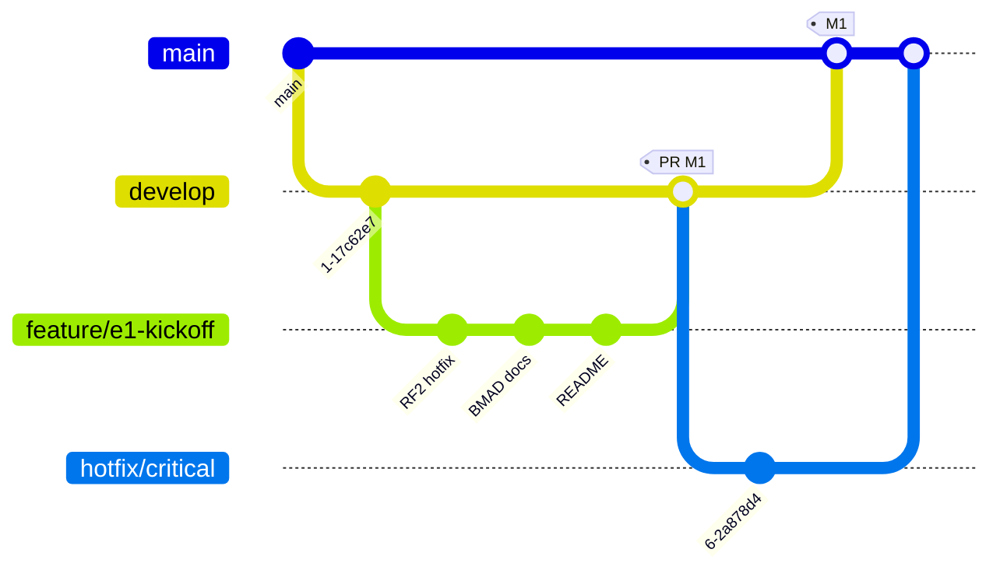
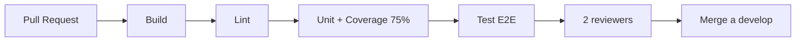

# CityExpress — Milestones, Gitflow & Quality Gates

> Documento operativo del ciclo E1. **Lectura obligatoria antes de tomar cualquier ticket.**

---

## 1. Definition of Ready

Una tarea entra a sprint cuando:

- ✅ Tiene un milestone asignado.
- ✅ Tiene criterio de aceptación verificable (no "queda lindo").
- ✅ El RF/RNF/RDOC del enunciado al que mapea está enlazado en [`requirements.md`](./requirements.md).
- ✅ Si toca código de producción, lleva test plan.
- ✅ Si usa programación agéntica, el archivo `docs/prompts/<fecha>-<tema>.md` está creado o referenciado.

## 2. Definition of Done

Una tarea cierra cuando:

- ✅ Build pasa (`pnpm run build`).
- ✅ Lint pasa (`pnpm run lint`).
- ✅ Tests unitarios pasan y coverage del módulo tocado **≥ 75%**.
- ✅ Si aplica: test E2E correspondiente pasa (`pnpm run test:e2e`).
- ✅ PR mergeado a `develop` con **2 reviewers** aprobados.
- ✅ AI log actualizado con la decisión final y tradeoffs.
- ✅ Si afecta deploy: smoke test contra EC2 con HTTPS validado.

---

## 3. Roadmap operativo

> **Plan comprimido vigente desde 2026-04-28.** Deadline real: **domingo 2026-05-03**. El plan original de 4 semanas se reescribió a 6 días calendario (lun 28-abr → dom 3-may). Ver `roadmap.md §4` para el Gantt actualizado.

### M2 — Auth & Broker E1 (mié 29/04, 1 día — paralelización 2 owners)

- Setup Auth0 / Cognito (RNF06).
- AWS API Gateway REST con Custom Authorizer + subdominio + CORS (RNF04, RNF07).
- Migrar `connector/index.js` al broker E1: queue `city.<code>.q`, vhost `/fulfillment`, exchange `fulfillment.x`, routing key `city.<code>`, type `package-transit`.
- Implementar ACK/NACK contract (per `requirements.md §5`).
- Implementar retry Fibonacci hacia el broker (RNF10).
- Migración Prisma: agregar índice en `packageId`, modelo `Route` para tabla de distancias.
- AI logs: `2026-04-29-auth-setup.md`, `2026-04-29-connector-e1.md`.

### M3 — Routing & Auditoría (jue 30/04 → vie 1/05, ~1.5 días · vie es feriado CL)

- Tabla de distancias dinámica (RF02 E1): consumir `distance-table` desde canal `central`.
- Sistema de ruteo (RF03): redirección, drop `maxHops=0`, recepción.
- Auditoría hacia central: emitir `transit`, `transit-redirect`, `expired`, `received`, `delivered`.
- Diagrama UML formal `.drawio` siguiendo AY3 (stereotypes `<<component>>`, interfaces named, NFRs anotados) — RDOC01.
- AI logs: `2026-04-30-routing.md`, `2026-04-30-auditor.md`, `2026-05-01-uml-final.md`.

### M4 — Frontend & Cloud (vie 1/05 → sáb 2/05, ~2 días)

- Frontend Vue.js (Vite) en repo `CityExpress-frontendG15` consumiendo el API Gateway.
- Build estático en S3 + distribución CloudFront (RNF08).
- ECR sobre EC2 (RNF01) — pipeline para push de imágenes.
- New Relic APM + infra (RNF09).
- Budget alerts AWS (RNF03).
- RF01 (vista paquetes recibidos) y RF04 (entrega final).
- AI logs: `2026-05-01-frontend-integration.md`, `2026-05-02-ecr-newrelic.md`.

### M5 — Buffer + Demo (dom 3/05, deadline 23:59 CLT)

- **Smoke test E2E** contra producción (HTTPS, broker, auditoría, frontend).
- Grabar video demo (≤5min) cubriendo RF01-RF04 + auditoría visible.
- Subir entregable formal según instrucciones del enunciado.
- Buffer reservado para **incidentes de última hora** (CORS, certificados ACM, broker desconectado).
- Demo en vivo con ayudante: agendarse según calendario docente (puede caer post-entrega).

- Demo en vivo con ayudante.
- Coevaluación grupal (form que define el equipo docente).

---

## 4. Gitflow obligatorio



| Branch | Regla |
|---|---|
| `main` | **Protegida.** No push directo. Requiere 2 reviewers. Sólo recibe merges desde `develop` o `hotfix/*`. Conventional Commits en inglés (`feat`, `fix`, `docs`, `refactor`, `test`, `chore`, `perf`). |
| `develop` | Integración. PRs desde `feature/*` con al menos 1 reviewer. |
| `feature/<scope>` | Branches de trabajo. Nombre descriptivo (`feature/e1-kickoff`, `feature/auth0-integration`, `feature/router-rf03`). |
| `hotfix/<scope>` | Sólo para incidentes en `main`. Mergea de vuelta a `develop` también. |

### 4.1 PR template (obligatorio)

```markdown
## Resumen
<2-3 líneas explicando qué cambia y por qué>

## Cambios
- archivo:línea — qué cambió
- ...

## Cómo funciona
<diagrama mental: input → procesamiento → output, qué módulos toca>

## Cómo se verificó
- [ ] `pnpm run build`
- [ ] `pnpm run lint`
- [ ] `pnpm run test:cov` (coverage del módulo: __%)
- [ ] `pnpm run test:e2e` (si aplica)
- [ ] Smoke test manual: <pasos>
- [ ] Render markdown ok (si aplica)

## AI usage
- [ ] Sesión registrada en `docs/prompts/YYYY-MM-DD-<tema>.md`
- Link: ...

## Trazabilidad
- Cierra: RF/RNF/RDOC __
- Issue: #__ (si aplica)
- Milestone: M__
```

### 4.2 Branch protection (acción manual del owner)

GitHub Settings → Branches → Add rule para `main`:

- ✅ Require a pull request before merging
- ✅ Require approvals: **2**
- ✅ Dismiss stale pull request approvals when new commits are pushed
- ✅ Require status checks to pass before merging
  - `build`
  - `test:cov`
  - `lint`
- ✅ Require branches to be up to date before merging
- ✅ Restrict who can push to matching branches (sólo admins, en emergencia)

> **No la activa el agente IA**, la activa el owner del repo con permisos.

---

## 5. Quality gates (CI obligatorio antes de M2)



| Gate | Comando | Criterio | Bloquea merge |
|---|---|---|---|
| Build | `pnpm run build` | exit 0 | sí |
| Lint | `pnpm run lint` | 0 errors | sí |
| Type-check | `tsc --noEmit` (parte de build) | exit 0 | sí |
| Unit + coverage | `pnpm run test:cov` | coverage del módulo ≥ 75% | sí |
| E2E | `pnpm run test:e2e` | exit 0 | sí en M2+ |
| Reviews | GitHub | 2 aprobaciones | sí en `main` |

> El workflow `.github/workflows/ci.yml` se crea en M1.5 / M2. **No lo crea esta PR** (out of scope del kickoff).

---

## 6. AI usage policy

Por enunciado E1, sección "Del uso de agentes de AI":

1. **Cada interacción relevante** con un agente debe registrarse como un archivo nuevo en `docs/prompts/YYYY-MM-DD-<tema>.md`.
2. Estructura mínima:

   ```markdown
   # Session: YYYY-MM-DD — <tema>
   **Agente:** <modelo>
   **Owner:** <persona>
   **Branch:** feature/<scope>

   ## Prompt
   ...

   ## Output
   ...

   ## Decisión
   ...

   ## Tradeoffs
   ...
   ```

3. Cada decisión debe documentarse con tradeoffs explícitos.

---

## 7. Sanciones del enunciado (recordatorio)

- `.env` commiteado → −0.5 décimas.
- `.pem` commiteado → no se corrige la entrega.
- Loops/abuso de mensajería → ban escalado (24h → 1 sem +5 dcto → 3 sem +30 dcto).
- No cumplir RFs Esenciales → entrega no revisada (1.0).
- No cumplir BMAD/GSD declarado → entrega anulada (1.0).

---

## 8. Atraso (Fibonacci, F1=6 F2=6)

| Horas | Fib | Nota máxima |
|---|---|---|
| 0:01 – 5:59 | 6 | 6.5 |
| 6:00 – 11:59 | 6 | 6 |
| 12:00 – 23:59 | 12 | 5 |
| 24:00 – 41:59 | 18 | 4.5 |
| 42:00 – 71:59 | 30 | 4 |
| 72:00+ | ... | 1 |
