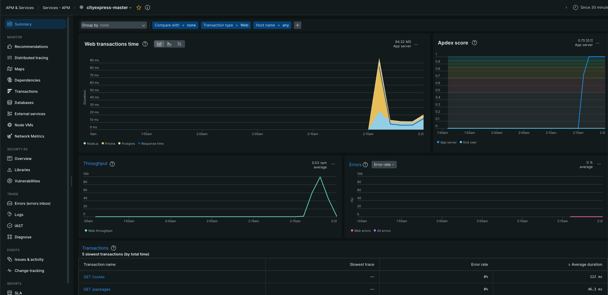

# Monitoring E1 — New Relic

> Evidencia y operación de monitoreo para el deploy E1 de CityExpress G15. No incluye license keys ni API keys reales.

---

## 1. Objetivo

E1 usa New Relic para observar dos superficies:

- APM del servicio `cityexpress-master` dentro del container Docker.
- Infrastructure agent en la EC2 `cityexpress-ec2`.

Valores reales:

| Campo | Valor |
|---|---|
| New Relic account ID | `8018520` |
| Master App ID | `1085291491` |
| APM link | `https://rpm.newrelic.com/accounts/8018520/applications/1085291491` |
| Agent version observed | `13.19.2` |

## 2. New Relic APM Master

La instrumentación del master se carga desde Compose, no desde el `CMD` del `Dockerfile`.

`docker-compose.prod.yml`:

```yaml
master:
  environment:
    - NODE_ENV=production
    - NODE_OPTIONS=-r newrelic
    - NEW_RELIC_LICENSE_KEY=${NEW_RELIC_LICENSE_KEY}
    - NEW_RELIC_APP_NAME=cityexpress-master
    - NEW_RELIC_NO_CONFIG_FILE=true
```

Además, el master tiene `newrelic` en `dependencies`:

```json
{
  "dependencies": {
    "newrelic": "^13.19.2"
  }
}
```

Variables en `/opt/cityexpress/.env`:

```env
NEW_RELIC_LICENSE_KEY=<license-key>
```

Link del dashboard:

```text
https://rpm.newrelic.com/accounts/8018520/applications/1085291491
```

## 3. Evidencia y Screenshots

Captura APM del master (`cityexpress-master`) con Web transactions time, Apdex score, Throughput, Error rate y la tabla de las 5 transacciones más lentas (`GET /routes`, `GET /packages`):



La captura confirma:

- App `cityexpress-master` reportando al collector New Relic.
- Apdex score `0.75 [0.1]`.
- Web transactions time pico ~85 ms.
- Throughput visible en RPM.
- Error rate `0%` en la ventana observada.

## 4. Infrastructure Agent en EC2

Instalación con New Relic CLI:

```bash
curl -Ls https://download.newrelic.com/install/newrelic-cli/scripts/install.sh | sudo bash
sudo NEW_RELIC_API_KEY=<new-relic-api-key> NEW_RELIC_ACCOUNT_ID=8018520 \
  /usr/local/bin/newrelic install -n infrastructure-agent-installer
```

Verificar servicio:

```bash
sudo systemctl status newrelic-infra
sudo journalctl -u newrelic-infra --since "15 minutes ago"
```

El host esperado en New Relic Infrastructure corresponde a la EC2:

| Campo | Valor |
|---|---|
| EC2 name | `cityexpress-ec2` |
| Instance ID | `i-0bfbc93f5e6340508` |
| Public IP | `52.5.25.114` |
| AZ | `us-east-1d` |

## 5. Generar Tráfico para Dashboards

Obtener token desde el SPA o Auth0 y exportarlo localmente:

```bash
export TOKEN=<auth0-access-token>
```

Loop recomendado:

```bash
for i in $(seq 1 80); do
  curl -s https://api.andresitowan.com/routes \
    -H "Authorization: Bearer $TOKEN" > /dev/null

  curl -s https://api.andresitowan.com/packages \
    -H "Authorization: Bearer $TOKEN" > /dev/null
done
```

También sirve generar errores controlados para validar error rate:

```bash
curl -i https://api.andresitowan.com/packages
```

Ese request debe responder 401 por falta de token.

## 6. Cómo Verificar que el Agente Está Conectado

Ver variables cargadas dentro del container:

```bash
sudo docker exec cityexpress_master env | grep -i new
```

Debe aparecer:

```text
NEW_RELIC_APP_NAME=cityexpress-master
NEW_RELIC_NO_CONFIG_FILE=true
NEW_RELIC_LICENSE_KEY=<license-key>
NODE_OPTIONS=-r newrelic
```

Ver log del agente:

```bash
sudo docker exec cityexpress_master tail -30 newrelic_agent.log
```

El log debe mostrar:

```text
Agent state changed from connecting to connected
```

Si no conecta:

- Confirmar que `newrelic` está instalado en `dependencies`.
- Confirmar que `NODE_OPTIONS=-r newrelic` está activo en Compose.
- Confirmar que `NEW_RELIC_LICENSE_KEY` existe solo en `/opt/cityexpress/.env`.
- Reiniciar el container master después de cambiar env vars.

```bash
cd /opt/cityexpress
sudo docker compose -f docker-compose.prod.yml --env-file .env up -d --force-recreate master
```

> `--force-recreate` es necesario cuando solo cambian env vars en `.env` o en el bloque `environment:` del compose: sin él, Docker Compose no recrea el container si la imagen no cambió.

## 7. Alertas Recomendadas

No son exigidas para E1; quedan recomendadas para E2 o post-entrega:

| Alerta | Condición | Ventana | Acción |
|---|---|---|---|
| Latencia alta | Avg response time > 1s | 5 min | Email/Slack `<TODO>` |
| Error rate alto | Error rate > 5% | 5 min | Email/Slack `<TODO>` |
| Host saturado | CPU > 80% | 10 min | Email/Slack `<TODO>` |
| Disco bajo | Disk free < 15% | 10 min | Email/Slack `<TODO>` |

