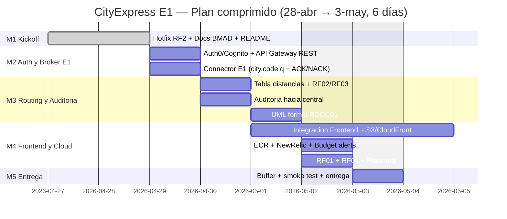
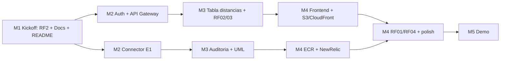

# CityExpress — Roadmap

> **Última actualización:** 2026-04-28
> **Deadline E1:** **domingo 2026-05-03 23:59 (CLT)** — quedan **5 días**.
> **Owner:** Grupo 15 (G15)
> **Metodología:** GSD / BMAD (obligatoria por enunciado E1)
> **Repositorios:**
> - Backend: `CityExpress-backendG15` (este repo)
> - Frontend: `CityExpress-frontendG15`

---

## 1. Visión

CityExpress es la red de mensajería **dimensional** que sucede a QuackPackage. Cada grupo opera una **ciudad** del catálogo (G15 = ciudad asignada por el equipo docente) y debe:

- Recibir mensajes desde el broker central RabbitMQ (`broker.iic2173.org:5671`).
- Persistir y mostrar los paquetes recibidos.
- Rutar los paquetes a otras ciudades cuando el destino no es la propia.
- Auditar todas las acciones (`transit`, `transit-redirect`, `expired`, `received`, `delivered`) hacia la central.
- Entregar paquetes al cliente final una vez que `deliverNotBefore` lo permita.

> **Suposición clave del enunciado:** recibir un mensaje respecto a un paquete ≡ recibir el paquete físico a través del portal.

---

## 2. Estado E0 (LegitBusiness · QuackPackage)

| Req | Pts | Descripción | Estado |
|---|---|---|---|
| RF1 | 3 | `GET /packages` listado aplanado | ✅ |
| RF2 | 1 | `GET /packages/:id` detalle | ⚠ → **fix en M1** |
| RF3 | 2 | Paginación `?page&limit` | ✅ |
| RF4 | 4 | Filtros (origin, strategy, payment, date) | ✅ |
| RNF1 | 5 | Connector RabbitMQ independiente | ✅ |
| RNF2 | 4 | Master recibe POSTs del connector | ✅ |
| RNF3 | 3 | NGINX directo en EC2 | ✅ |
| RNF4 | 2 | Dominio `.tech` | ✅ |
| RNF5 | 2 | EC2 Free Tier | ✅ |
| RNF6 | 4 | Postgres en container | ✅ |
| Compose 1-3 | 15 | Master + DB + Connector orquestados | ✅ |
| Variable HTTPS | 15 | Let's Encrypt + redirect 80→443 + cron 2x/d | ✅ |

**Penalización RF2:** el endpoint busca por `idpk` (PK del evento, llave de idempotencia interna) en vez de `packageId` (id del paquete que el cliente conoce y que viaja en `packageBody.id`). Se corrige en Milestone **M1** sin tocar el resto del código (atomicidad de cambio).

---

## 3. Visión E1 (CityExpress · 60 ptos grupales)

### 3.1 Requisitos Funcionales (20 ptos)

- **RF01 (5p) Esencial** — Vista de paquetes recibidos: identificador, ciudad origen/destino, MaxHops vigente, fechas, estado y última acción.
- **RF02 (3p) Esencial** — Vista de conectividad ciudad-a-ciudades reflejando la tabla de distancias dinámica.
- **RF03 (10p) Esencial** — Sistema de ruteo: redirección, drop por `maxHops=0`, recepción local.
- **RF04 (2p)** — Concretar entrega cuando `deliverNotBefore` lo permita, sin doble entrega, con cambio de estado visible.

### 3.2 Requisitos No Funcionales (34 ptos)

- **RNF01 (5p) Esencial** — Backend/Frontend separados; SPA en container Docker distinto. **ECR sobre EC2.**
- **RNF03 (2p) Esencial** — Budget alerts AWS.
- **RNF04 (5p) Esencial** — API detrás de **AWS API Gateway** (REST o HTTP), subdominio asociado, **CORS** correcto.
- **RNF05 (3p) Esencial** — HTTPS backend y frontend.
- **RNF06 (4p) Esencial** — Servicio de Auth (Auth0 recomendado, Cognito alternativa) con JWK estándar.
- **RNF07 (3p)** — API Gateway autentica via servicio del RNF06 (Custom Authorizer en REST).
- **RNF08 (3p)** — Frontend en S3 + CloudFront.
- **RNF09 (5p)** — Monitoreo SaaS (New Relic recomendado): APM + infra.
- **RNF10 (2p)** — Resiliencia: containers auto-restart + retry Fibonacci hacia el broker.

### 3.3 Documentación (6 ptos)

- **RDOC01 (3p)** — Diagrama UML de componentes para la entrega.
- **RDOC02 (2p)** — Pasos para replicar instalación + flujo de monitoreo.
- **RDOC03 (1p)** — Cómo correr la app en local.

---

## 4. Milestones (plan comprimido — 5 días reales)

> **Cambio respecto a versiones previas:** el plan original asumía 4 semanas hasta 2026-05-13. El deadline real del enunciado es **domingo 2026-05-03**. M1 ya está en curso desde 2026-04-27; M2-M5 se comprimen para caber antes del corte. M5 (demo en vivo) se mantiene **post-entrega** según indique el equipo docente.

| ID | Ventana | Días | Foco | Entregables |
|---|---|---|---|---|
| **M1** | lun 27/04 → mar 28/04 | 2 | Kickoff + hotfix + docs | RF2 fix · BMAD docs (ya creados) · README profesional · log AI inicial |
| **M2** | mié 29/04 | 1 | Seguridad + broker E1 | Auth0/Cognito tenant · API Gateway REST + Custom Authorizer · connector queue `city.<code>.q` con ACK/NACK + retry Fibonacci |
| **M3** | jue 30/04 → vie 01/05* | 1.5 | Lógica de negocio | Tabla distancias dinámica · ruteo (RF03) · auditoría 5 eventos · UML formal `.drawio` (RDOC01) |
| **M4** | vie 01/05 → sáb 02/05 | 2 | Cloud + frontend integration | API Gateway live · S3+CloudFront frontend deployed · ECR push · New Relic APM · Budget alerts · RF01 + RF04 |
| **M5** | dom 03/05 | 1 | Buffer / Demo | Smoke test E2E HTTPS · video demo · entrega formal |

> *jueves 1/05 es **feriado nacional** en Chile (Día del Trabajador). Asumir productividad reducida — buffer de 2-3h máx en jornada.

### Compromisos críticos del nuevo plan
- **M2 paraleliza** Auth y connector entre 2 personas para caber en 1 día.
- **M3 paraleliza** routing y auditoría; UML se cierra el viernes en horario reducido (feriado).
- **RF01 y RF04** se adelantan a M4 sábado para no quedar de último.
- **Tests ≥75%** se exigen por módulo en cada PR — no se acumulan al final.
- **Si M2 se atrasa >12h**, descartar New Relic (RNF09 no esencial) y priorizar RNFs Esenciales.

---

## 5. Riesgos & mitigaciones

| Riesgo | Impacto | Mitigación |
|---|---|---|
| Costo AWS supera Free Tier | Bloqueo financiero | Budget alerts (RNF03) + cuenta nueva sin tarjeta principal + tarjeta prepago |
| Broker `broker.iic2173.org` caído | No hay ingreso de paquetes | Retry Fibonacci (RNF10) + reconexión persistente + logs de eventos perdidos |
| Auth0 free tier insuficiente | Costo extra | Cognito como plan B (mismo flujo JWK estándar) |
| Atraso en M3 (ruteo) | Penalización Fibonacci (ver `milestones.md §8`) | Buffer de 24h en M4; bloqueante: no entregar M2 sin tests |
| Pérdida de mensajes por NACK mal manejado | Penalización auditor | Test E2E con mock del broker antes de tocar prod |
| Programación agéntica no declarada | **Plagio** | Notificar al ayudante en M1 + mantener `docs/prompts/` actualizado |
| `.env` o `.pem` commiteado | -0.5 nota / no corregido | gitignore actualizado + pre-commit hook recomendado |

---

## 6. Dependencias entre milestones

---

## 7. Trazabilidad

- Detalle de cada milestone → [`milestones.md`](./milestones.md)
- Lista exhaustiva de RFs/RNFs/RDOCs → [`requirements.md`](./requirements.md)
- Diagramas y NFRs priorizados → [`architecture.md`](./architecture.md)
- Bitácora AI por sesión → [`prompts/`](./prompts/)
